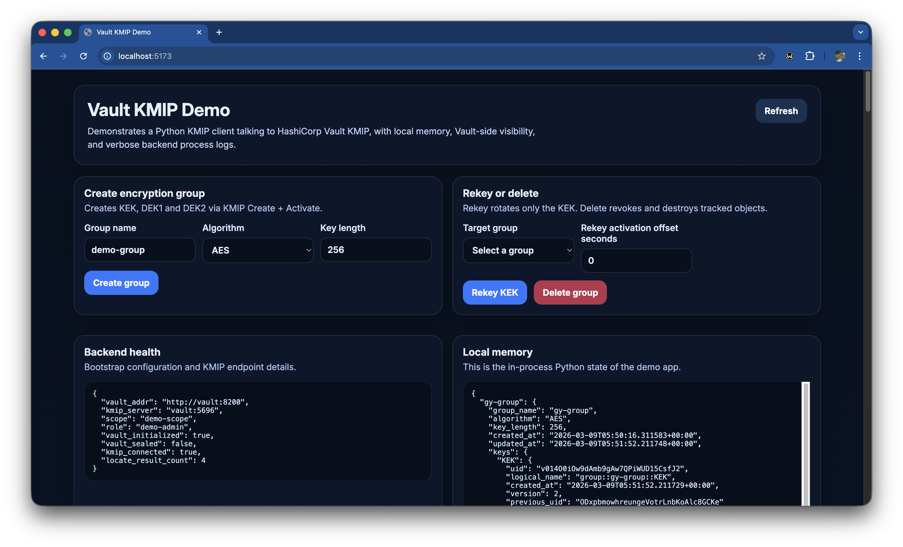

# Vault KMIP Demo

A containerised demonstration showing how a Python KMIP client can
connect to a HashiCorp Vault KMIP server, create and manage grouped
encryption keys, and visualise both local application state and
Vault-side KMIP objects.



This project is intended as an educational reference and demonstration
tool for learning how KMIP interacts with Vault Enterprise.

------------------------------------------------------------------------

## Important License Notice

This project does NOT include a HashiCorp Vault Enterprise license.

To run this demo you must supply your own Vault Enterprise license file.

The license file must be placed at:

`./vault/vault.hclic`

This file is NOT included in this repository and must be provided
separately by the user.

------------------------------------------------------------------------

## Architecture

The solution consists of:

-   Vault Enterprise running the KMIP secrets engine
-   A Vault bootstrap container that initializes and configures KMIP
-   A FastAPI backend that acts as a KMIP client
-   A React + Vite frontend UI
-   A Vault Browser panel to visualise KMIP objects

------------------------------------------------------------------------

## Requirements

You must have:

-   Docker
-   Docker Compose
-   A valid Vault Enterprise license file

------------------------------------------------------------------------

## Setup

1.  Place your Vault Enterprise license file:

`vault/vault.hclic`

2.  Start the stack:

`docker compose up --build`

To reset everything:

```
docker compose down -v 
docker compose up --build -d
```

------------------------------------------------------------------------

## Services

- Frontend UI: `http://localhost:5173\`
- Backend API: `http://localhost:8000\`
- Vault API: `http://localhost:8200\`
- Vault KMIP listener: `localhost:5696`

------------------------------------------------------------------------

## Backend API

API Swagger can be found in `http://localhost:8000/docs`

- `GET /api/health\`
- `GET /api/state\`
- `POST /api/groups/create\`
- `POST /api/groups/{group_name}/delete\`
- `POST /api/groups/{group_name}/rekey\`
- `GET /api/vault-browser`

------------------------------------------------------------------------

## Notes

This project is intended for educational demonstration purposes only and
should not be used as a production security architecture without
significant redesign.
